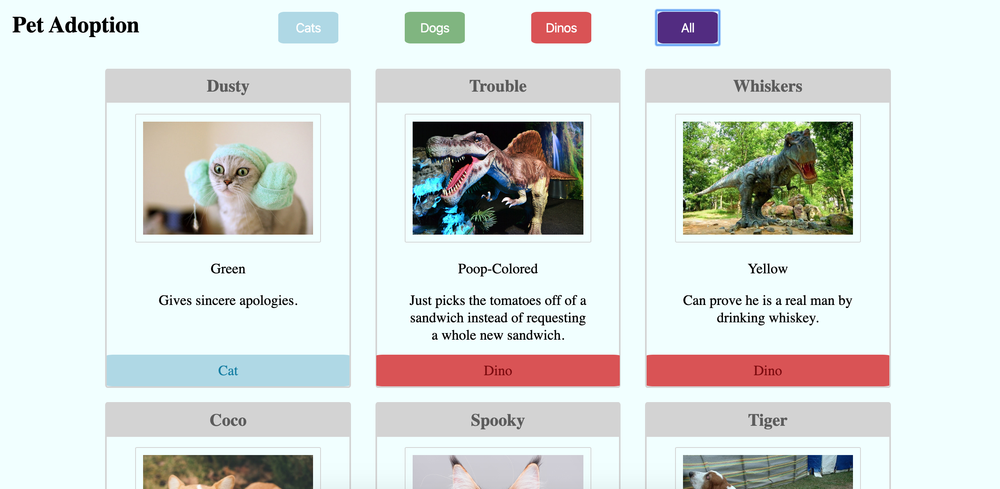
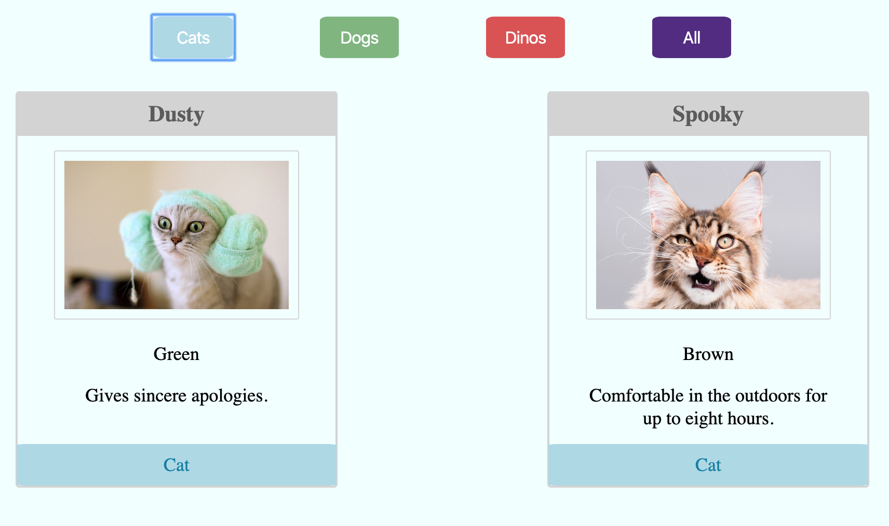
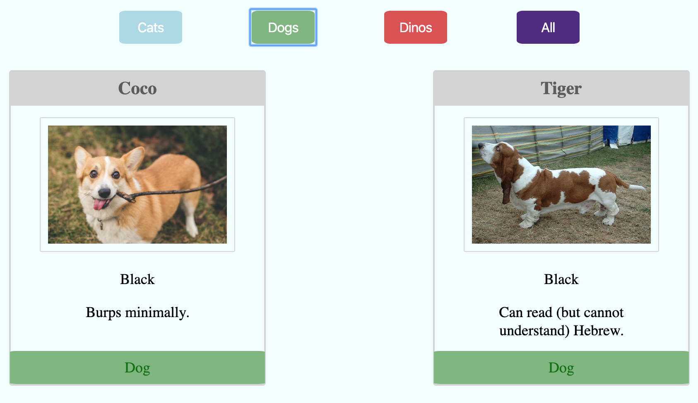
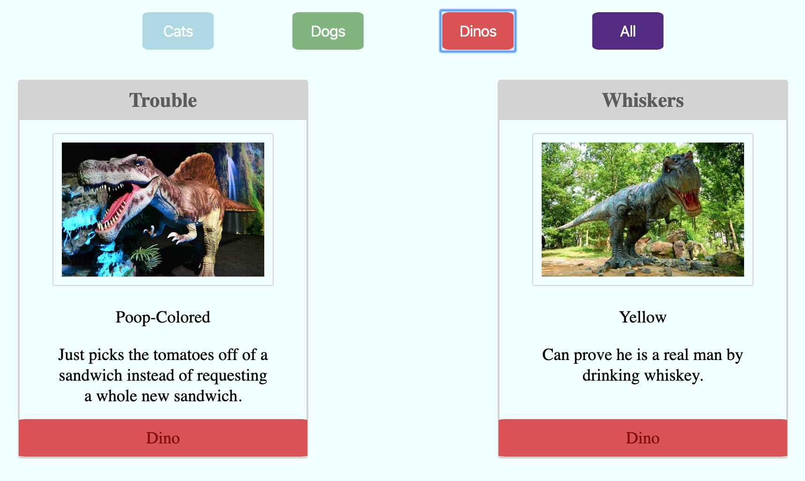

# pet-adoption

## Description
This project was used as an introduction to using Javascript functions to print a string to the DOM and incorporating click event listeners. 

We created an array of animals and looped through that array in main.js to print individual animal cards to the DOM. The cards were arranged using flexbox.

We also created HTML buttons inside index.html and assigned click events to each button using `document.getElementById()` to select each individual button and call a function that would filter the cards by animal type when the corresponding animal button was pressed. 

## Screenshots
Main project view

Cat button selected view

Dog button selected view

Dino button selected view

## How to run
1. Clone this repo
1. Make sure you have http-server installed via npm. If not get it [here](https://www.npmjs.com/package/http-server)
1. On your command line, run `hs -p 9999`
1. In your browser, go to `http://localhost:9999`